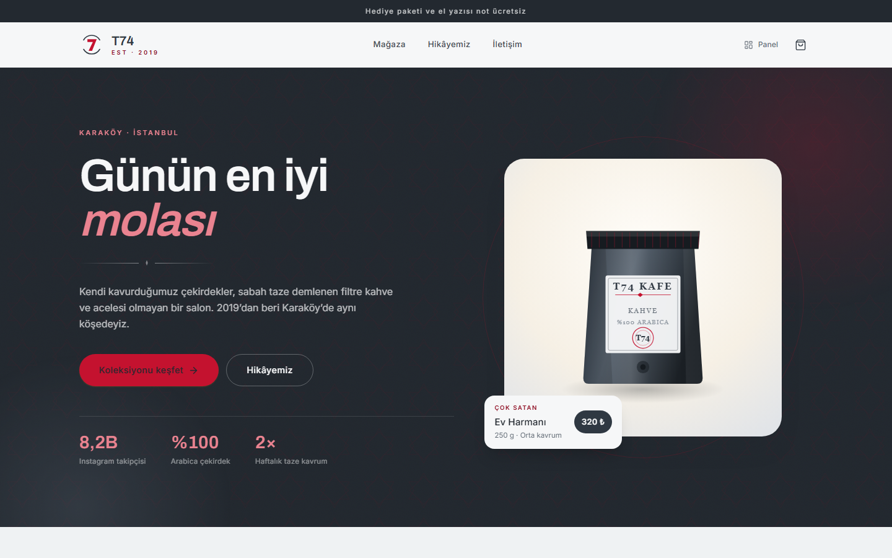
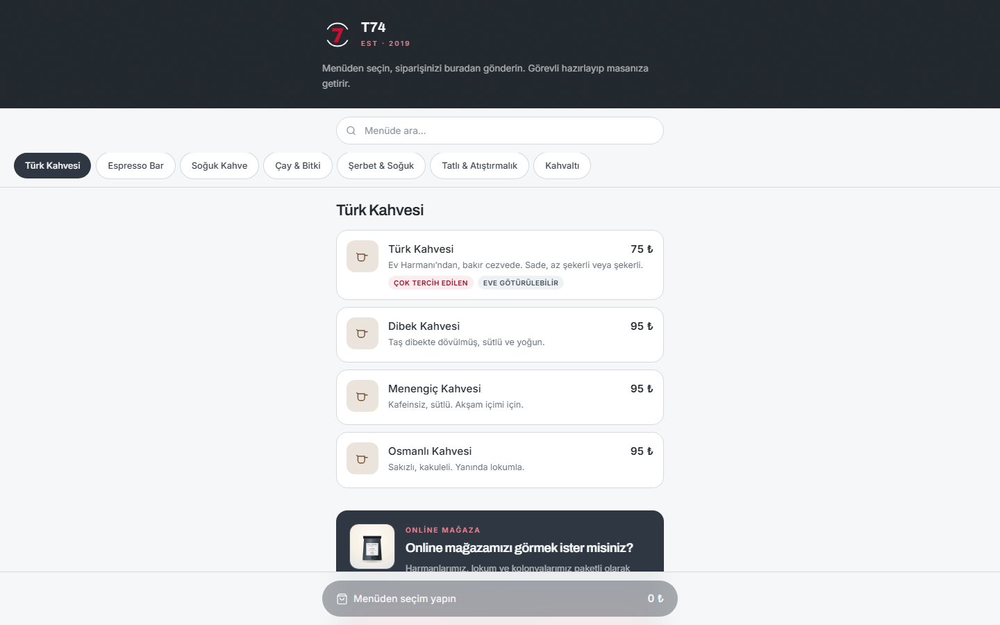
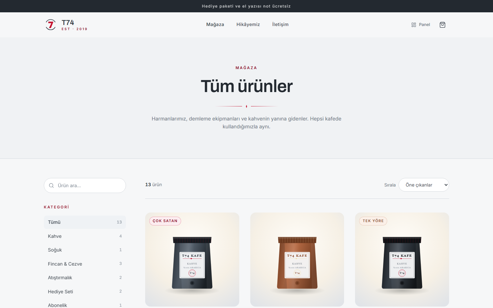
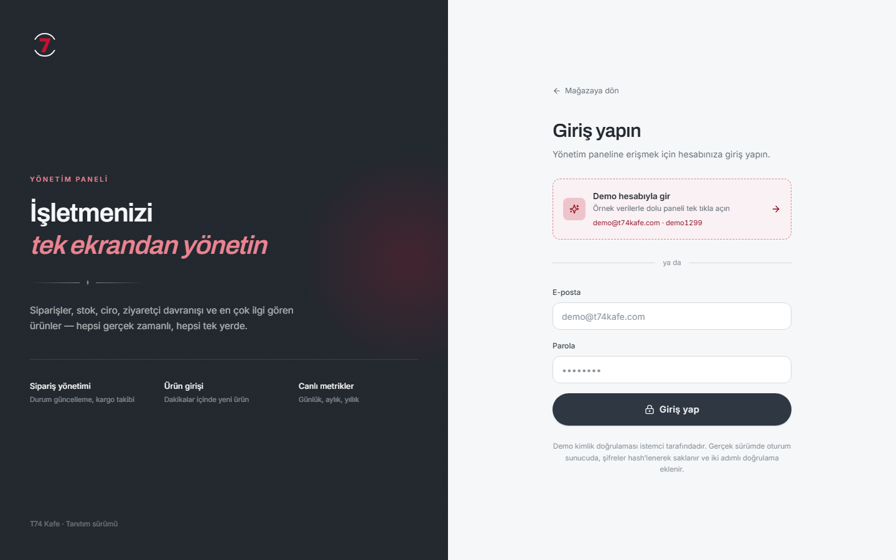

# T74 Kafe — QR Menü · Kasa · Online Mağaza

React tabanlı, modüler bir kafe yönetim sistemi. **T74 Kafe** adı altında
paketlenmiştir: müşteri görüşmelerinde gösterilen tanıtım sürümü budur.

**Canlı demo:** https://t74kafe-demo.vercel.app

Sistem üç parçadan oluşur:

1. **QR menü** — masadaki karekod okutulur, müşteri sipariş verir, sipariş
   masa numarası sorulmadan doğrudan kasaya düşer
2. **Kasa ve garson ekranları** — gelen siparişler masaya bağlanır, hesap özeti
   çıkar, adisyon kapatılır
3. **Online mağaza ve yönetim paneli** — ürün satışı, sipariş takibi, ciro ve
   ziyaret raporları

Özellikler modül modüldür; **Kafe → Kafe Plus → Kafe Pro → Kafe Pro Max**
paketleri hangi modülün açık olduğunu belirler (bkz. *Modüller ve paketler*).

> Demo arama motorlarına kapalıdır (`noindex`) — gerçek bir işletme sitesiyle
> karıştırılmasın diye. Link elden paylaşıldığında sorunsuz açılır. Bir müşteri
> için canlıya geçerken `index.html`'deki robots satırı ve `vercel.json`'daki
> `X-Robots-Tag` başlığı silinir.

## Ekran görüntüleri

| Vitrin | QR menü |
|---|---|
|  |  |

| Online mağaza | Yönetim paneli girişi |
|---|---|
|  |  |

> Kasa, garson ve yönetim ekranları giriş ister. Demoda giriş ekranındaki
> **Demo hesabıyla gir** kısayolu örnek verilerle dolu paneli tek tıkla açar.

---

### Yayınlama

GitHub deposu Vercel'e bağlıysa `main` dalına her push yeniden yayınlar.
Elle yayınlamak için:

```bash
npx vercel deploy --prod --yes
```

> Ürün beyaz etiketlidir: aynı çekirdek, bir işletme için markalandığında
> ayrı bir depoda ayrı yayınlanır. Markaya özgü ne varsa `src/config/brand.js`
> içinde durur; bileşenler yalnızca o sözleşmeyi okur.

---

## Çalıştırma

```bash
npm install
```

```bash
npm run dev
```

Tarayıcı `http://localhost:5173` adresinde açılır.

Üretim derlemesi:

```bash
npm run build
```

---

## Sunum haritası

Müşteriye gösterirken izlenecek sıra:

| # | Adres | Ne gösterilir |
|---|-------|---------------|
| 1 | `/` | Vitrin: hero, öne çıkan ürünler, koleksiyonlar, hikâye, Instagram şeridi |
| 2 | `/magaza` | 15 ürün, kategori + koleksiyon filtresi, sıralama, arama |
| 3 | Vitrindeki bir ürün | Ürün detayı: varyant seçimi, tat notları, akordiyon, benzer ürünler |
| 4 | Sepete ekle → `/odeme` | 3 adımlı ödeme: teslimat → ödeme → onay |
| 5 | `/siparis/<numara>` | Sipariş onayı, zaman çizelgesi, özet |
| 6 | `/yonetim` | **"Demo hesabıyla gir"** butonu — tek tık |
| 7 | Genel Bakış | Dönem seçici, ciro/sipariş/ziyaret/sepet metrikleri, içgörü kartları |
| 8 | Siparişler | Az önce verdiğiniz sipariş listenin en üstünde, "Yeni" durumda |
| 9 | Ürünler | Tablodan stok düzenleme, vitrine ekleme, yeni ürün girişi |
| 10 | Analitik | Dönüşüm hunisi, kanal/şehir/cihaz kırılımı, ürün ilgisi tablosu |
| 11 | `/menu` | **QR menü** — masa sormaz, karekod okutunca doğrudan açılır |
| 12 | Menüden seçip gönder | Ekranda kısa sipariş numarası çıkar (ör. **#084**) |
| 13 | `/garson` | **Garson ekranı** — elle sipariş al, kasaya gönder |
| 14 | `/kasa` | **Kasa** — gelen siparişler solda, masalar sağda. Siparişi masaya bağla |
| 15 | Masaya dokun | Hesap özeti: birleşik kalemler, kişi başı tutar, hesabı kapat |
| 16 | `/yonetim/menu` | **Menü yönetimi** — tablodan fiyat değiştir, kalemi satıştan kaldır |
| 17 | `/menu` (tekrar) | Değişikliğin anında yansıdığını göster |
| 18 | `/yonetim/kafe` | Kafe metrikleri, haftalık yoğunluk ısı haritası, kanal karşılaştırması |

> **Sunum ipucu (online):** 4. adımda sipariş verip 8. adımda o siparişi panelde
> göstermek en etkili an. "Müşteri sipariş verdi, siz aynı anda burada görüyorsunuz."
>
> **Sunum ipucu (kafe):** İki cihaz açtırın. Telefondan (11) sipariş verin,
> tablette kasada (14) belirsin, masaya bağlayın ve hesabı kapatın. Kafe
> sahibine "müşteri sipariş verdi, siz aynı anda görüyorsunuz" demek yeterli.

---

## Modüller ve paketler

Ürün tek parça değil. Her yetenek bağımsız açılıp kapanan bir **modül**;
paketler bu modüllerin hazır demetleri. Yönetim → **Paket ve Modüller**.

| Paket | Aylık | Kurulum | Modüller |
|---|---|---|---|
| **Kafe** | 2.500 ₺ | 12.000 ₺ | QR menü, menü yönetimi, karekod üretici |
| **Kafe Plus** | 4.500 ₺ | 20.000 ₺ | + garson ekranı, kasa & adisyon |
| **Kafe Pro** | 7.000 ₺ | 28.000 ₺ | + kafe raporları |
| **Kafe Pro Max** | 11.500 ₺ | 40.000 ₺ | + online mağaza, site analitiği, müşteri yönetimi |

Paket dışında **tek tek modül** de açılabilir (sonradan ek modül satmak için);
her modülün ayrı aylık fiyatı vardır (`src/config/modules.js`).

**Kilitli modül kaybolmaz.** Menüde asma kilitle görünür; tıklanınca hangi
paketle geldiğini, fiyatını ve tek başına eklenirse ne tutacağını anlatan
yükseltme ekranı çıkar. Müşteri neyi almadığını görsün diye böyle.

> **Sunum ipucu:** Müşterinin karşısında paketi canlı değiştirin. Menüden
> ekranların kilitlenip açıldığını görmek, fiyat listesi göstermekten çok daha
> ikna edici.

---

## Karekod üretici

Yönetim → **Karekodlar**. Her masa için markanızın renkleriyle çizilmiş kart üretir.

- **4 renk teması** (Zümrüt, Gece, Mürekkep, Bakır), **3 modül biçimi**
  (nokta, yuvarlak, klasik), ortada marka mührü
- Karekodlar hazır kütüphane çıktısı değil: modül matrisi kendimiz çizilir —
  yuvarlak noktalar, özel köşe göstergeleri, hata düzeltme seviyesi **H** (%30)
  olduğu için ortadaki mühür okumayı bozmaz
- **Yazdır** → yalnızca kartlar basılır, A4'e altı kart sığar
- Tek tek **SVG** (baskı) veya **PNG** (paylaşım) indirilebilir

### Masa ipucu

Karekod isteğe bağlı olarak `?m=<masa>` taşır. **Müşteriye hiçbir şey sorulmaz** —
ama kasada o sipariş için *"Masa 5"* düğmesi çıkar ve tek dokunuşla bağlanır.
Kasa isterse başka masa seçebilir. Kapatmak isterseniz karekod sayfasındaki
onay kutusunu kaldırın; tüm masalar aynı adrese gider.

---

## Kafe modülü (QR menü + garson + kasa)

E-ticaretten bağımsız çalışan, kafe içi operasyon katmanı. Tasarımın kilidi şu:
**sipariş masasız oluşur, masayı yalnızca kasa bilir.**

| Ekran | Adres | Kim kullanır |
|---|---|---|
| QR menü | `/menu` | Müşteri — telefon, giriş yok, masa sorulmaz |
| Garson | `/garson` | Garson — telefon |
| Kasa | `/kasa` | Kasiyer — tablet ya da bilgisayar |
| Menü yönetimi | `/yonetim/menu` | İşletmeci |
| Kafe raporları | `/yonetim/kafe` | İşletmeci |

**Akış:**

1. Müşteri karekodu okutur, menü doğrudan açılır (masa numarası girmez).
2. Seçip gönderir → ekranda **kısa sipariş numarası** çıkar (ör. #084).
3. Aynı anda garson da elle sipariş alıp kasaya gönderebilir.
4. Her iki kanal da **kasadaki tek kuyruğa** düşer.
5. Kasiyer siparişi bir masaya bağlar. Masa boşsa hesap açılır, doluysa
   sipariş mevcut hesaba eklenir.
6. Masaya dokununca hesap özeti çıkar: birleşik kalemler, kişi başı tutar,
   hangi siparişin nereden geldiği. Ödeme tipi seçilip hesap kapatılır.

Yanlış masaya bağlanan sipariş, hesap özetindeki zincir simgesiyle kuyruğa
geri gönderilebilir. Kasa ayrıca hesaba elle kalem ekleyebilir.

Menü kalemleri e-ticaret ürünlerine `linkedProductId` ile bağlıdır: masada
içilen Türk kahvesinin paketi menüde **"Bunu eve götürün"** kartı olarak çıkar.
Sipariş sonrası ekranda da online mağaza daveti vardır. İki tarafı birbirine
bağlayan yer burasıdır.

### Menü yönetimi

Menü kodda sabit değildir — `/yonetim/menu` üzerinden yönetilir:

- **Fiyat** doğrudan tablodan düzenlenir, kaydet demeye gerek yok.
- **Satıştan kaldır** kalemi silmeden gizler ("bugün cheesecake bitti"). QR menüde
  ve garson ekranında anında kaybolur, geçmiş raporlarda kalır.
- **Yeni kalem** eklenir: ad, kategori, fiyat, açıklama, hazırlık süresi, tercih
  seçenekleri (Sade / Az şekerli gibi) ve e-ticaret ürünü bağlantısı.
- **Öne çıkar** kaleme "Çok tercih edilen" etiketi verir.
- **Menüyü sıfırla** tüm değişiklikleri geri alır.

> Fiyat değişikliği **açık hesapları etkilemez.** Her sipariş kendi fiyatını
> kaydeder; masadaki müşteri sipariş anındaki fiyatı öder. Doğrulandı: menü 95 ₺
> iken açık hesaptaki aynı kalem 75 ₺ kalıyor.

### Kafe verisi

`src/data/cafe.js` — 32 menü kalemi, 18 masa (3 bölge), 4 garson. Tohumlu üretim:
açılıştan bugüne ~2.000 kapanmış hesap, saatlik yoğunluk matrisi, kasada bekleyen
2–4 sipariş ve açık 4–7 masa. Bir masa hesabı 1–3 siparişten oluşur; ilk sipariş
dolu, sonrakiler ("bir çay daha") küçüktür. Ortalama hesap ~430 ₺, kişi başı ~150 ₺.

### Yazarkasa (ÖKC) hakkında

Kasa ekranı **yazarkasanın yerine geçmez, yanında çalışır.** Hesap kapatma
adımı bunu açıkça yazar: sipariş yönetimi ve raporlama sistemde, mali fiş
mevcut ÖKC'den kesilir. Müşteriye "yazarkasadan kurtulacaksınız" denmemeli —
ÖKC entegrasyonu yetkili entegratörlük gerektirir ve bu demonun kapsamı dışıdır.

### Giriş bilgileri

Giriş ekranındaki **"Demo hesabıyla gir"** butonu yeterlidir — e-posta zaten
o markanın adresiyle dolu gelir.

Elle girilecekse: `demo@t74kafe.com` / `demo1299`

(Demo doğrulaması herhangi bir e-posta + 4 haneli parolayı kabul eder.)

### Demoyu sıfırlama

Panel → Ayarlar → **Demoyu sıfırla**, ya da kenar çubuğundaki aynı buton.
Eklenen ürünleri, demo siparişlerini ve stok değişikliklerini temizler.

---

## Marka ve beyaz etiket

`src/config/brand.js` markaya ait ne varsa tek dosyada tutar; bileşenlerin
içinde marka adı, ürün adı ya da şehir gömülü değildir.

| Alan | Ne yapar |
|------|----------|
| `orderPrefix` | Sipariş numarası ve otomatik SKU öneki (`T74-2263`) |
| `menuTweaks` | Kafe menüsünün markaya bakan açıklamaları ve mağaza bağlantıları |
| `cityWeights` | Demo siparişlerinin şehir dağılımı |
| `packLabels` | Ürün görsellerindeki ambalaj yazıları |
| `emblemText` | Mühürdeki metin |
| `hero`, `story`, `about`, `contact` | Vitrin metinleri |
| `hours`, `address`, `phone`, `instagram` | İletişim bilgileri |

Yeni bir müşteriye aynı sistemi sunmak için: `brand.js`'e ikinci bir kayıt,
bir de o markanın katalog dosyası. Kod tarafında değişiklik gerekmez.

Demo verisi (siparişler, ziyaretler, raporlar) aktif katalogdan üretilir ve
tarayıcı depolaması markaya göre ayrıktır.

---

## Teknik

| | |
|---|---|
| Çatı | React 18 + Vite 6 |
| Yönlendirme | React Router 6 |
| Stil | Tailwind CSS 4 (`@theme` ile marka tokenları) |
| Grafik | Recharts |
| İkon | lucide-react |
| Durum | React Context + `localStorage` |

Yönetim paneli ayrı bir pakete bölünmüştür (`React.lazy`); grafik kütüphanesi
yalnızca panele girildiğinde indirilir. Mağaza paketi ~83 KB (gzip).

### Klasör yapısı

```
src/
├── components/
│   ├── admin/     AdminLayout, AdminUI (Panel/StatCard/DataTable), charts
│   ├── site/      SiteLayout (header/footer/sepet), ProductCard
│   └── ui/        Bits (buton, rozet, süsleme), ProductImage
├── data/
│   ├── catalog.js   Ürünler, kategoriler, koleksiyonlar
│   └── generate.js  Tohumlu demo verisi üreteci
├── lib/
│   ├── format.js    TR para/tarih/sayı biçimleme
│   └── metrics.js   Dönem özeti, huni, içgörüler
├── config/
│   ├── brand.js     Marka tanımı (T74 Kafe)
│   └── modules.js   Modüller, paketler, tek modül fiyatları
├── components/cafe/ CafeShell (personel kabuğu), CafeBits (simge, panel)
├── data/cafe.js     Menü, masalar, sipariş ve hesap üreteci
├── pages/           Vitrin sayfaları
├── pages/cafe/      QrMenu, Garson, Kasa
├── pages/admin/     Panel sayfaları
└── store/           TenantContext (marka + modül), StoreContext, CafeContext
```

---

## Ürün görselleri

Gerçek fotoğraf olmadığı için her ürün, markanın renk paletiyle çizilmiş bir SVG
ambalaj görseliyle temsil edilir (`components/ui/ProductImage.jsx`). Sekiz ambalaj
tipi vardır: kahve paketi, hediye kutusu, fincan, cezve, lokum, kolonya, şerbet,
sepet. İnternet bağlantısı gerektirmez.

Gerçek fotoğraflar geldiğinde yalnızca bu bileşen `` ile değiştirilir;
arayüzün geri kalanına dokunulmaz.

---

## Demo verisi

`src/data/generate.js` tohumlu (seeded) rastgelelik kullanır: sayfa yenilendiğinde
aynı geçmiş üretilir, yalnızca bugüne ait satırlar eklenir. Sunum sırasında
rakamlar oynamaz.

- **Zaman aralığı:** son ~6 ay → bugün
- **Üretilen:** ~1.150 sipariş, ~820 müşteri, günlük ziyaret ve ürün görüntülenme
- **Kaynak:** aktif markanın kataloğu — her site kendi ürünlerinin geçmişini üretir
- **Büyüme eğrisi:** açılıştan itibaren artan, hafta sonu yoğunluklu, ara ara
  kampanya sıçramalı

Görüntülenme ve satış ayrı katsayılarla üretilir; bu sayede panel "çok bakılıp az
satılan ürün" gibi gerçek bir içgörü çıkarabilir.

### Renk paleti

Palet kurumsal T74 logosundan türetilmiştir: metalik gri gövde ve logodaki
"7"nin kırmızısı, soğuk açık gri zeminde.

| Rol | Jeton | Değer |
|---|---|---|
| Gövde | `steel-800` / `steel-900` | `#2F3842` / `#232930` |
| Vurgu | `crimson` | `#C4122F` |
| Zemin | `snow` / `mist` | `#F6F7F8` / `#EDEFF1` |

Ölçülen kontrastlar: gövde metni 13,7:1 · ikincil metin 8,9:1 · vurgu metni
8,8:1 · koyu zeminde kırmızı 4,6:1 — hepsi WCAG AA üstünde.

### Grafik renkleri

Kategorik palet ölçülerek seçilmiştir (yüzey `#FFFFFF`):

| Slot | Renk | |
|---|---|---|
| 1 | `#C4122F` | marka kırmızısı |
| 2 | `#35618F` | çelik mavisi |
| 3 | `#12857B` | petrol yeşili |

Kontrastlar 4,50–6,45:1. Renk körlüğü ayrımı: normal görüş ΔE ≥ 26,3;
döteranopi ΔE ≥ 17,4; protanopi ΔE ≥ 22,4 — hepsi eşiğin üstünde. Dördüncü bir
ton eşikleri geçmediği için 3'ten fazla kategori "Diğer" altında toplanır.
Sıralı rampa (`#F2B7C0 → #82101F`) tek tonlu ve L* olarak monotondur.

---

## Demoda örneklenmiş (mock) olanlar

Bunlar canlıya geçişte gerçek entegrasyonla değiştirilir:

- **Ödeme:** kart formu devre dışı, tahsilat yapılmaz → iyzico / PayTR sanal POS
- **Kimlik doğrulama:** istemci tarafında → sunucu oturumu + hash'li parola + 2FA
- **Veri:** tarayıcıda `localStorage` → veritabanı (PostgreSQL / Supabase)
- **E-posta:** gönderilmez → sipariş onayı, kargo bildirimi (Resend / Postmark)
- **Kargo:** takip numarası üretilir → Yurtiçi / Aras API entegrasyonu
- **Ürün fotoğrafı:** SVG çizim → gerçek fotoğraf + CDN
- **İletişim formu:** iletilmez → e-posta servisi

## Canlıya geçmeden önce gerekenler

- Mesafeli satış sözleşmesi, ön bilgilendirme formu, iade/teslimat koşulları
- KVKK aydınlatma metni ve çerez izni
- Sanal POS başvurusu (şirket/şahıs firması + vergi levhası, onay 3–7 iş günü)
- SSL sertifikası (hosting ile birlikte, ücretsiz)
- Google Search Console + Analytics kurulumu
